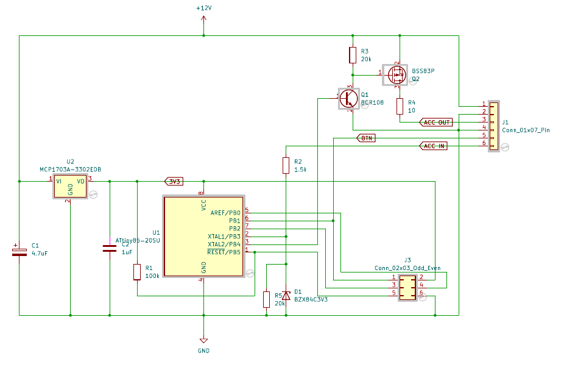

# Car Head-Unit ACC Timer

A small circuit and firmware based on an ATtiny85 that adds independent power-button control to a car head unit.

The device sits in-line with the vehicle's ACC (accessory/ignition) signal and gives you two extra capabilities:

- **ACC on:** the button can toggle the head unit off or back on while the ignition remains on.
- **ACC off:** the button turns the head unit on with an automatic 30-minute power-off timer, so you can keep listening after parking without draining the battery.

Power consumption in the off state is around 40 µA.

The project is available under the MIT license (see `LICENSE.txt`).

## Hardware

Minimal component count around an ATtiny85, designed for very low quiescent current.

The KiCad schematic and PCB layout are in `hardware/auto-acc-timer/`. A 3D-printable housing is in `hardware/auto-acc-timer/housing/`.



### MCU Pin Assignment

| Pin | Direction | Signal |
|-----|-----------|--------|
| PB1 | Input | Power button (active low, internal pull-up) |
| PB3 | Input | ACC input from vehicle |
| PB4 | Output | ACC output to head unit |
| PB0 | I²C SDA | Optional OLED display |
| PB2 | I²C SCL | Optional OLED display |

### J1 — Main Connector (1×6, 2.54 mm)

| Pin | Signal | Description |
|-----|--------|-------------|
| 1 | +12V | Vehicle power input |
| 2 | GND | Ground |
| 3 | ACC OUT | Switched ACC output to head unit |
| 4 | GND | Ground |
| 5 | BTN | Power button input |
| 6 | ACC IN | ACC input from vehicle ignition |

### J3 — ISP Programming Header / OLED Display (2×3, 2.54 mm)

| Pin | Signal | Description |
|-----|--------|-------------|
| 1 | MOSI (PB1) | SPI data in — shared with BTN net |
| 2 | VCC (3V3) | 3.3 V supply |
| 3 | SCK (PB2) | SPI clock / I²C SCL |
| 4 | MISO (PB0) | SPI data out / I²C SDA |
| 5 | RESET | MCU reset |
| 6 | GND | Ground |

J3 doubles as the OLED display connector. Connect an SSD1306 128×32 display using pins 2 (VCC), 3 (SCL), 4 (SDA), and 6 (GND).

## Operating Modes

| Condition | Short press | Long press |
|-----------|-------------|------------|
| ACC on, output on | Turn output off | — |
| ACC on, output off | Turn output on | — |
| ACC off, output off | Turn output on (starts 30 min timer) | — |
| ACC off, timer running | Cancel timer, turn output off | Reset timer to 30 min |

When the timer expires the output is cut automatically.

## Optional OLED Display

Compile with `USE_I2C=1` to enable an SSD1306 OLED (128×32) that shows the remaining time in `MM:SS` using a 7-segment font. A settings menu (long-press when idle) lets you adjust the power-off timer and the ACC-off delay; values are stored in EEPROM.

## Building

Requires `avr-g++` (C++20) and `avrdude`. The programmer is a Bus Pirate on `/dev/ttyUSB0`.

```sh
# Build firmware
make

# Flash firmware and EEPROM
make upload

# Regenerate font headers (requires tools/ttf2bmh.py)
make fonts
```

The build output lands in `.build/src/firmware.hex`.

## Software Overview

| File | Purpose |
|------|---------|
| `src/main.cc` | Application logic, pin setup, task loop |
| `src/timer.h` | 40-bit timer on USI/Timer1, ~1 kHz resolution at 8 MHz |
| `src/debounce.h` / `btn.h` | Debounce and button event detection (short/long/double press) |
| `src/task_list.h` | Cooperative task scheduler with idle-mode sleep |
| `src/i2c.h` | Non-blocking bit-bang I²C master driven by a flash-resident command program |
| `src/display.h` / `display.cc` | SSD1306 driver and font renderer |

See [`doc/i2c.md`](doc/i2c.md) for a detailed description of the I²C implementation.
